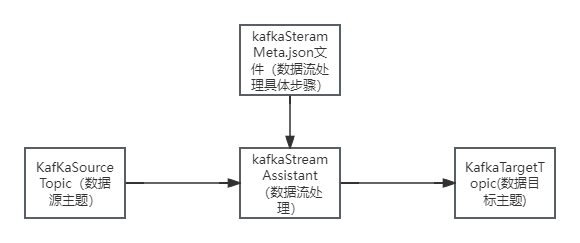

# KafkaStreamAssistant

## 简介


kafkaStreamAssistant是一个协助完成kafkaStream数据流数据处理的帮助工具，主要是帮助无java语言基础的开发者做一些基础的kafkaStream流数据处理，通过编写配置KafkaStreamMeta.json文件，去完成数据流处理，减少开发成本，
无需再关注数据流处理细节。

## 快速开始
### 编写KafkaStreamMeta.json
kafkaStreamMeta.json文件，用来定义你这次数据流处理任务的具体信息，包含输入topic、输出topic、处理逻辑、处理参数等。
### KafkaStreamMeta.json文件结构
```
{
  "kafkaEnvironment": {
    "applicationId": "your_application_id",
    "bootstrapServers": "your_bootstrap_servers",
    "defaultKeySerde": "org.apache.kafka.common.serialization.Serdes$StringSerde",
    "defaultValueSerde": "org.apache.kafka.common.serialization.Serdes$StringSerde",
    "consumerKeyDeserializer": "java.lang.String",
    "consumerValueDeserializer": "java.lang.String"
  },
  "kafkaStreamJob": [
    {
      "sourceTopic": "",
      "streamTask": [
        {
          "behavior": "",
          "operation": [
            {
              "type": "double",
              "field": "",
              "operator": "",
              "value": ""
            },{
              "type": "Boolean",
              "field": "",
              "value": ""
            }
          ],   
          "targetTopic": ""
        }
      ]
    }
  ]
}
```
kafkaEnvironment: kafka环境信息配置

|            key            |                   描述                    |
|:-------------------------:|:---------------------------------------:|
|       applicationId       |      应用程序的唯一标识符，用于在Kafka中标识生产者或消费者      |
|     bootstrapServers      |                kafka服务地址                |
|      defaultKeySerde      |          默认的键序列化类，用于将键序列化为字节序列          |
|     defaultValueSerde     |          默认的值序列化类，用于将值序列化为字节序列          |
|  consumerKeyDeserializer  | 消费者使用的键反序列化类，默认为String类，用于将字节序列反序列化为键对象 |
| consumerValueDeserializer | 消费者使用的值反序列化类，默认为String类，用于将字节序列反序列化为值对象 |

kafkaStreamJob： kafkaStream数据流处理任务配置

|              key              |              描述               |
|:-----------------------------:|:-----------------------------:|
|          sourceTopic          | 应用程序的唯一标识符，用于在Kafka中标识生产者或消费者 |
|      streamTask.behavior      |      使用的kafkaStream转换算子       |
|   streamTask.operation.type   |            数据字段类型             |
|  streamTask.operation.field   |             数据字段名             |
| streamTask.operation.operator |            字段处理策略             |
|  streamTask.operation.value   |           字段处理的目标值            |

### 项目执行
使用命令java -jar -DKafkaStreamMeta=KafkaStreamMeta.json文件路径 KafkaStreamAssistant-version.jar

### example


